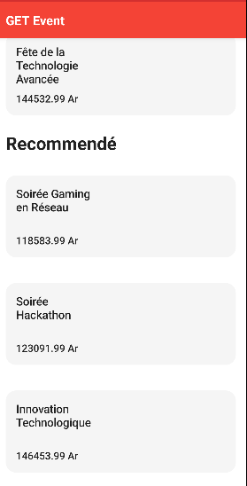
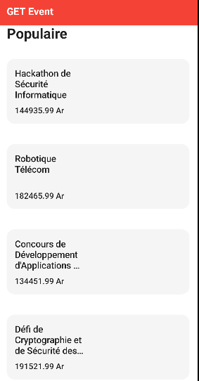
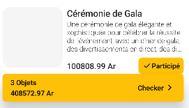
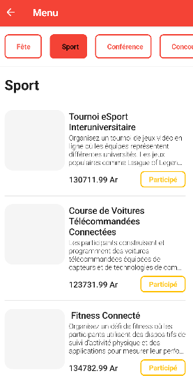
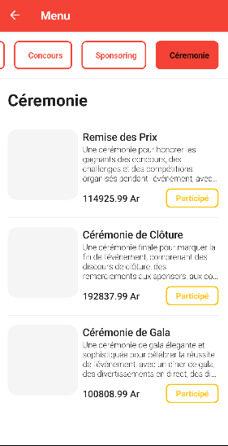
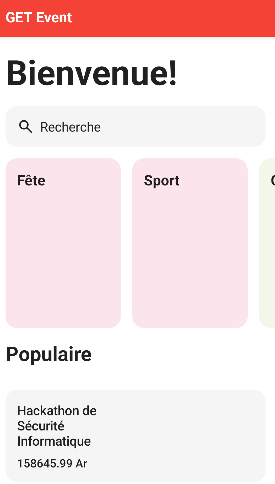
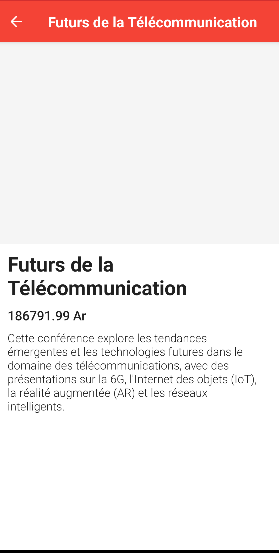
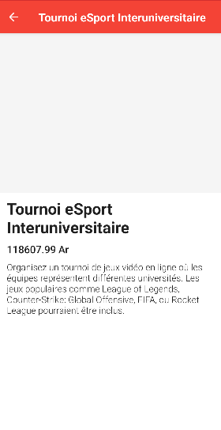

#   GET EVENT
Projet Kotlin dirigé par des élèves MP1 en Télécommunication qui sont:

RATSIMBAZAFY Tolonirina Rommé

RANDRIANARIVELO GUTTILA Toavinjanahary Nathanaela

ANDRIATAHINA Michel Angelo

ANDRIAMIFIDY Samuel Misa

SOLONDRABEZAFY Harry Manoa

## 📱 Capture d'écran

| Recommendé   | Populaire|
| ---- | ---- | ---- | ---- |
|  |  |  | 

### ⮕ Capture
|  |  |
| ---- | ---- |
|  

### ⮕ Capture
|  |  |  |
| ---- | ---- | ---- |
|  |  |  |
|  |  |  |

