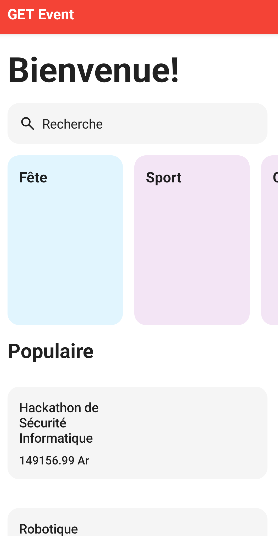
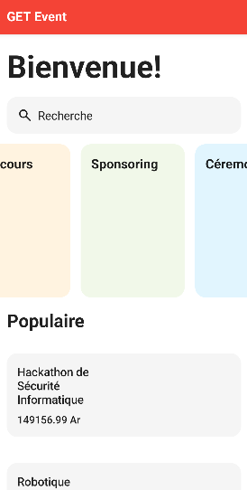
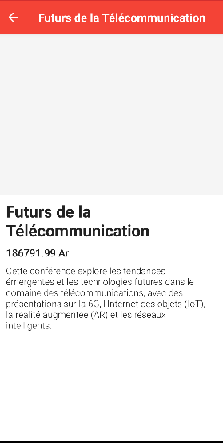
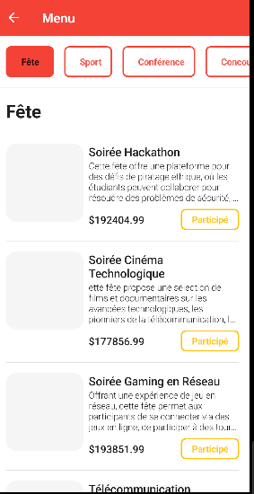

#   GET EVENT
Projet Kotlin dirigé par des élèves MP1 en Télécommunication qui sont:

RATSIMBAZAFY Tolonirina Rommé
RANDRIANARIVELO GUTTILA Toavinjanahary Nathanaela
ANDRIATAHINA Michel Angelo
ANDRIAMIFIDY Samuel Misa
SOLONDRABEZAFY Harry Manoa

## 📱 Capture d'écran

| Recommendé  | Défilement | Populaire|Capture|
| ---- | ---- | ---- | ---- |
|  |  |  |  |


### ⮕ Capture
|  |  |
| ---- | ---- |
|  

### ⮕ Capture
|  |  |  |
| ---- | ---- | ---- |
|  |  |  |
|  |  |  |


```
